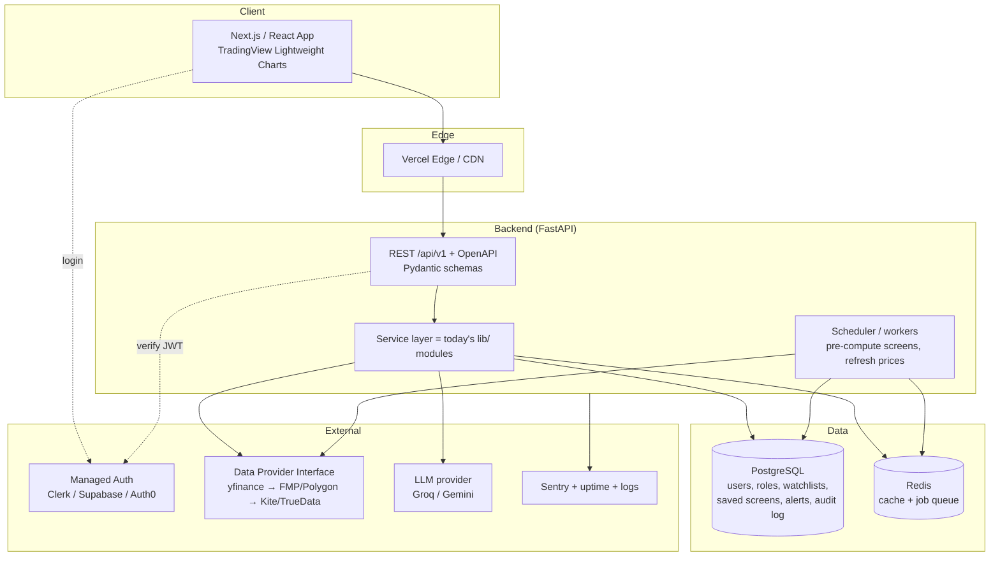

# Motherboard — Enterprise Migration & Architecture Plan

**Status:** Design document (no code yet — for decision-making)
**Context:** Pre-launch startup, tight budget, intends to put real/paying users in front of it soon.
**Author's stance:** Build an *enterprise-credible* stack a small team can ship and afford, with explicit upgrade points for when funding lands. Reject the maximalist "Bloomberg + Kubernetes on day one" path — it would bankrupt a pre-launch startup before it has users.

---

## 0. The one-line decision

Migrate off Streamlit to a **decoupled FastAPI backend + Next.js frontend**, deployed on **managed PaaS (not Kubernetes)**, using **managed auth (not hand-rolled OAuth)**, with a **pluggable data-provider layer** so you start on free/cheap feeds and upgrade per customer demand. Keep ~80% of your existing Python logic.

---

## 1. What carries over (and why this is affordable)

Your `lib/` modules use Streamlit **only for caching** (`@st.cache_data` ×21, `@st.cache_resource` ×1) — verified. There is no real UI coupling in your business logic.

| Layer | Files | Migration fate |
|---|---|---|
| **Business logic** | `lib/market_data, fundamentals, institutional, options, screens, signals, value_investing, value_chain, ai_analyst, macro, rates, news, deals, search, risk, etf_peers, backtest, logos, charts(data parts)` | **Reuse ~verbatim.** Swap `@st.cache_data` → a Redis-backed cache decorator. Becomes the FastAPI service layer. |
| **Auth** | `lib/auth.py` | **Replace** with managed auth (Clerk/Supabase/Auth0). Keep the PBKDF2 logic only as a fallback/migration script for existing users. |
| **UI** | `pages/*.py`, `lib/ui.py` | **Discard.** Rebuilt in Next.js/React. |
| **Config** | `lib/config.py`, `.env` | **Reuse**, move secrets to platform secret manager. |

**Implication:** the expensive part of a "rewrite" (re-deriving financial logic, screeners, Greeks, scoring) is already done and survives. You're really building an API wrapper + a new frontend, not rewriting the product.

---

## 2. Target architecture (lean enterprise)



### Component choices (with budget rationale)

| Concern | Recommended (lean) | Why / cheaper-than | Upgrade when |
|---|---|---|---|
| **Frontend** | Next.js + shadcn/ui (Radix) + TanStack Table | Free, data-dense, keyboard-friendly. shadcn = own your components, no license. | — |
| **Charts** | **TradingView Lightweight Charts** (Apache-2.0, free) | Pro feel, crosshairs, overlays. The full TradingView library needs a license — defer. | Customers demand drawing tools |
| **Backend** | **FastAPI** (Python) | Keeps your `lib/`. Async, auto OpenAPI docs, Pydantic validation. | — |
| **Hosting** | **Render / Railway / Fly.io** (Docker) | No Kubernetes. One Dockerfile, push to deploy. K8s/ECS is premature ops burden pre-revenue. | >~10k concurrent or multi-region |
| **DB** | **PostgreSQL** (Neon / Supabase / Render) | Free tiers exist. Handles users, watchlists, audit, saved screens. | — |
| **Time-series** | **Stay on Postgres** initially | TimescaleDB/Influx/Arctic is premature. Postgres holds millions of OHLC rows fine. | Tick-level / heavy intraday volume |
| **Cache + queue** | **Redis (Upstash free tier)** | Replaces `@st.cache_data`; backs the job queue. | — |
| **Background jobs** | **APScheduler** in-process → **Celery** later | Pre-compute screeners on a cron so they're instant. Celery is overkill at first. | Many heavy concurrent jobs |
| **Auth** | **Managed (Clerk / Supabase Auth / Auth0)** | Gives OAuth2/OIDC, **MFA, SSO, JWT, refresh rotation, secure cookies out of the box.** Building this yourself is weeks + a liability. Kills audit items #4, #5, #6, #7. | Enterprise SSO contracts (Okta/AzureAD) — all three support it |
| **Observability** | **Sentry** (errors) + **structlog** JSON logs + **UptimeRobot/BetterStack** | All have free tiers. OpenTelemetry/Datadog later. | Funded |
| **CI/CD** | **GitHub Actions**: ruff + pytest + deploy, staging + prod | Free at this scale. Addresses #3, #21. | — |

---

## 3. Data strategy (the real cost driver — be honest)

The audit is right that yfinance is not enterprise-grade, but the fix is **not** Bloomberg ($24k/yr/terminal) for a pre-launch startup. Build a **provider abstraction** and tier it:

```
DataProvider (interface)
  ├── YFinanceProvider      # free, current — educational tier
  ├── FMPProvider           # Financial Modeling Prep ~$20–60/mo: fundamentals,
  │                         #   statements, estimates → fixes the screener data gaps (#10)
  ├── PolygonProvider       # US market data, startup pricing
  └── IndiaProvider         # Kite Connect (Zerodha, ~₹2,000/mo) / Upstox / TrueData
                            #   / Global Datafeeds — real NSE/BSE incl. bulk-deal feeds (#11)
```

- One interface, swap implementations per environment or per **subscription tier** (free users → yfinance; paid → licensed).
- Add a **data-quality layer** (#15): staleness checks, null/anomaly validation, circuit breakers — cheaply, as a wrapper around the interface, no Great Expectations needed initially.
- **Caching makes free data viable longer:** Redis TTLs (1d history → 1h; intraday → 15s) solve the cold-start/latency complaints (#18) and reduce paid-API call volume when you upgrade.

**Honest cost:** real Indian intraday + bulk-deal data is the line item that actually costs money (~$25–100/mo to start). Everything else can launch near-free.

---

## 4. Compliance — decide early (India-specific)

- **#29 is the most important non-engineering item.** In India, providing research/recommendations **for a fee** can require **SEBI Research Analyst (RA) registration**. Your current "EDUCATIONAL" label is *protecting* you. Removing it while charging money is the opposite of what the audit implies.
- Action before charging: legal review of (a) RA registration need, (b) required disclaimers/disclosures, (c) data-vendor redistribution licenses (you generally **cannot** resell NSE/Bloomberg data without a redistribution agreement).
- Engineering supports this with: per-action **audit log** (#35) in Postgres, persisted disclaimers, and AI-output provenance (#33).

---

## 5. Phased migration (each phase ships independently)

### Phase 0 — Stabilize current app *(days, do regardless)*
Buys safety while you build. No rewrite.
- Remove hardcoded default admin creds; require admin password via env, refuse insecure default. **(real vuln)**
- Login attempt rate-limiting / lockout (#9, partial).
- Fix Macro yield-curve empty-state + retry/fallback (#13).
- CSV/Excel export on screeners & statements (#34) — table stakes, cheap.
- `pytest` smoke tests on `lib/` + GitHub Actions CI (ruff + pytest) (#3, #21).

### Phase 1 — Extract the backend *(2–4 weeks)*
- Stand up FastAPI; mount `lib/` as the service layer; swap cache decorator to Redis.
- Versioned REST `/api/v1/...` with Pydantic schemas + OpenAPI docs (#16).
- Add Postgres; move users off `users.json`; integrate managed auth (#4–#7, #17).
- **Keep Streamlit temporarily as a thin client against the API** — decouples logic without a UI rewrite yet. De-risks everything downstream.

### Phase 2 — Frontend *(3–6 weeks)*
- Next.js app: auth flow, Terminal, Market Pulse, Screeners, Workspace.
- TradingView Lightweight Charts (#23); command palette + ticker-jump hotkeys (#24); grouped nav + global search bar (#25).
- Retire Streamlit pages as each Next.js equivalent reaches parity.

### Phase 3 — Product features *(parallel)*
- Watchlists, portfolios + P&L (#30); saved/named screens + history (#32); price alerts & notifications (#31); export everywhere (#34).
- Background pre-computation of screeners so results are instant (#19).

### Phase 4 — Hardening
- Granular RBAC: view-only / analyst / PM / admin, feature-gated (#6).
- API rate limiting + abuse prevention (#9); full audit log (#35); richer admin panel (#36).
- Observability: Sentry + structured logs + uptime + tracing (#20); staging/prod with rollback (#3).
- Integrate first **paid data provider** behind the interface; data-quality monitoring (#10, #11, #15).

### Phase 5 — Scale *(when funded)*
- Autoscaling, CDN, multi-region (#2); TimescaleDB if tick volume demands (#12); enterprise SSO/MFA tiers, SLA, PagerDuty (#2, #4); full TradingView license; mobile/responsive + light mode (#27, #28).

---

## 6. Indicative monthly cost (lean launch → early paid)

| Item | Launch | With paid data |
|---|---|---|
| Frontend (Vercel) | $0 | $20 |
| Backend host (Render/Fly) | $7–25 | $25–50 |
| Postgres (Neon/Supabase) | $0 | $25 |
| Redis (Upstash) | $0 | $10 |
| Auth (Clerk free → paid) | $0 | $25 |
| Error/uptime (Sentry/UptimeRobot) | $0 | $26 |
| **Market data** | $0 (yfinance) | **$30–125** (FMP + Kite/India) |
| Domain | ~$1 | ~$1 |
| **Total** | **~$10–30/mo** | **~$160–280/mo** |

vs. a single Bloomberg Terminal ≈ **$2,000/mo**. The lean path is enterprise-credible at ~1% of the "maximalist" cost.

---

## 7. Audit triage — all 36 points mapped

| # | Item | Verdict | Where |
|---|---|---|---|
| 1 | Migrate off Streamlit | ✅ Valid | Phase 1–2 |
| 2 | Proper cloud infra | ⚠️ Partial — PaaS now, K8s later | Phase 1 / 5 |
| 3 | CI/CD | ✅ Valid | Phase 0 |
| 4 | Replace custom auth | ✅ Valid (use managed) | Phase 1 |
| 5 | "Session forces re-login each page" | ❌ **False** (persists in-session) | — |
| 6 | Granular RBAC | ✅ Valid | Phase 4 |
| 7 | "Passwords insecure" | ❌ **False** (PBKDF2-200k+salt) | — |
| 8 | Public Fork button | ⚠️ Real issue = **hardcoded admin creds**; make repo private | Phase 0 |
| 9 | Rate limiting | ✅ Valid | Phase 0/4 |
| 10 | Licensed data | ✅ Valid (tiered, not Bloomberg) | Phase 4 |
| 11 | Live bulk-deal feed | ✅ Valid (India provider) | Phase 4 |
| 12 | Time-series DB + pipeline | ⚠️ Premature; Postgres first | Phase 5 |
| 13 | Yield-curve fails to load | ✅ **Real bug** | Phase 0 |
| 14 | Multi-source news + NLP | ⚠️ Nice-to-have | Phase 3+ |
| 15 | Data-quality monitoring | ✅ Valid (lightweight) | Phase 4 |
| 16 | API layer | ✅ Valid | Phase 1 |
| 17 | Database | ✅ Valid (Postgres) | Phase 1 |
| 18 | Caching | ✅ Valid (Redis) | Phase 1 |
| 19 | Job queue | ✅ Valid (scheduler→Celery) | Phase 3 |
| 20 | Logging/observability | ✅ Valid | Phase 4 |
| 21 | Tests | ✅ Valid | Phase 0+ |
| 22 | Component library | ✅ Valid (shadcn) | Phase 2 |
| 23 | Charting upgrade | ✅ Valid (TV Lightweight) | Phase 2 |
| 24 | Keyboard shortcuts | ✅ Valid | Phase 2 |
| 25 | Scalable nav | ✅ Valid | Phase 2 |
| 26 | Drag/resize workspace | ✅ Valid | Phase 2/3 |
| 27 | Mobile/responsive | ⚠️ Later | Phase 5 |
| 28 | Light mode | ⚠️ Later | Phase 5 |
| 29 | "EDUCATIONAL" / SEBI | ✅ **Critical — keep label, get legal advice** | Phase 0 (legal) |
| 30 | Watchlists/portfolios | ✅ Valid | Phase 3 |
| 31 | Alerts/notifications | ✅ Valid | Phase 3 |
| 32 | Saved screens/history | ✅ Valid | Phase 3 |
| 33 | Grounded AI + provenance | ✅ Valid | Phase 3/4 |
| 34 | Export to CSV/Excel | ✅ Valid (easy win) | Phase 0 |
| 35 | Audit log | ✅ Valid | Phase 1/4 |
| 36 | Richer admin panel | ✅ Valid | Phase 4 |

**Summary:** ~27 valid, 4 premature/later for your stage, **2 factually false** (#5, #7), and the audit **missed** the one genuinely urgent vuln (hardcoded admin credentials in `lib/auth.py`).

---

## 8. Recommended immediate next step

Do **Phase 0** now (days, low risk, ships on current Streamlit) — it removes the real security bug, fixes the yield-curve bug, adds export + CI/tests, and buys a safe runway. Then start **Phase 1** (FastAPI extraction) since your logic is already decoupled. Hold all paid-data and infra spend until you have users and have cleared the SEBI/compliance question.
